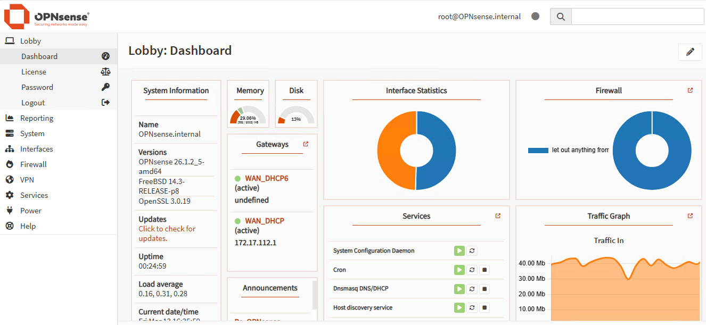
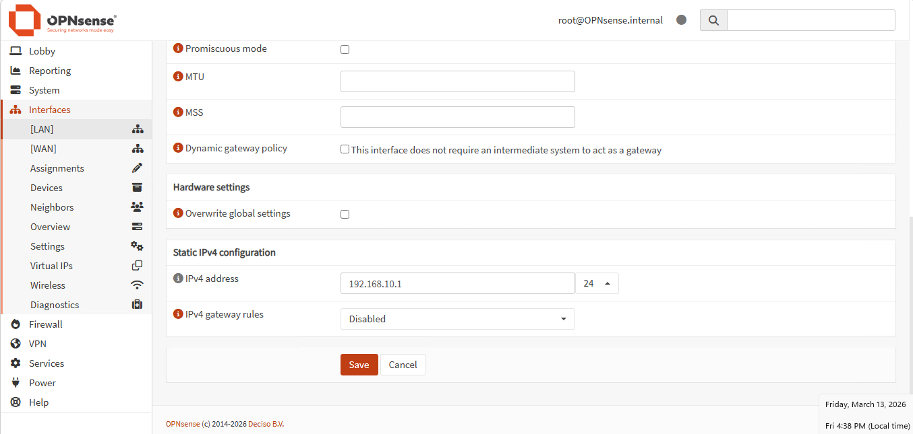

# Hyper-V OPNsense Security Lab

A personal **cybersecurity home lab** built using **Microsoft Hyper-V** and **OPNsense firewall** to simulate a realistic internal network environment.

This project demonstrates how to design and deploy a small virtual enterprise network including firewall routing, multiple operating systems, and connectivity verification.

The lab environment is designed as a **hands-on learning platform** for networking, system administration, and cybersecurity experimentation.

---

## Lab Overview

This lab simulates a **small internal network environment** using virtualization.

Components included:

- Hyper-V virtualization
- OPNsense firewall
- Windows and Linux machines
- Kali Linux attacker machine
- Internal LAN network

The lab allows experimentation with:

- network topology
- firewall configuration
- system administration
- penetration testing
- network troubleshooting

---

## Network Topology

```
                Internet
                   │
                   ▼
                WAN Network
                   │
                   ▼
             OPNsense Firewall
                   │
                   ▼
          LAN Network 192.168.10.0/24
                   │
        ┌──────────┼───────────┐
        │          │           │
        ▼          ▼           ▼
     Windows11  WindowsServer  UbuntuServer
      Client        Server         Linux

                   │
                   ▼
                Kali Linux
             Security Testing
```

---

## Virtual Machines

| Machine | Role | OS | IP Address |
|-------|------|----|-----------|
| OPNsense | Firewall / Router | OPNsense | 192.168.10.1 |
| Windows 11 | Client workstation | Windows 11 | 192.168.10.144 |
| Windows Server | Server environment | Windows Server | 192.168.10.131 |
| Ubuntu Server | Linux server | Ubuntu Server | 192.168.10.132 |
| Kali Linux | Security testing | Kali Linux | 192.168.10.138 |
| Windows 11 (LAN2) | Segmented client | Windows 11 | DHCP (192.168.20.x) |

---

## Network Configuration

| Component | Description |
|-----------|-------------|
| WAN | External network connected to the internet |
| LAN | Internal network managed by OPNsense |
| Firewall | OPNsense controls traffic between networks |
| Virtual Switch | Hyper-V virtual networking |

---

## Connectivity Verification

Connectivity between the machines was tested using **ICMP ping**.

Example tests performed:

```
Windows11 → OPNsense
Windows11 → UbuntuServer
UbuntuServer → WindowsServer
KaliLinux → All machines
```

Successful responses confirmed:

- correct routing
- LAN communication
- firewall functionality
- network connectivity

---

## Screenshots


### Hyper-V Virtual Switches


### Virtual Machines (Hyper-V Manager)


### OPNsense Dashboard


### OPNsense Interfaces


### Network Connectivity Test


### IP Configuration


### Problem APIPA


---

## Project Structure

```
hyperv-opnsense-security-lab
│
├── README.md
│
├── docs
│   └── lab-notes.md
│
└── images
    ├── topology.png
    ├── opnsense-dashboard.png
    ├── firewall.png
    ├── hyperv.png
    ├── interfaces.png
    └── ping.png
```

---

## Documentation

Detailed notes and configuration steps are available in the **docs** directory.

Documentation includes:

- installation notes
- configuration steps
- troubleshooting
- lab observations

---

## Results

The lab environment was successfully deployed using Hyper-V with OPNsense acting as the firewall and gateway.

All machines were able to communicate within the LAN and access external networks through the firewall.

Connectivity testing verified that the network configuration works correctly.

---

## Key Skills Demonstrated

| Area | Skills |
|------|--------|
| Virtualization | Hyper-V deployment, VM configuration |
| Networking | LAN/WAN design, IP addressing |
| Security | Firewall configuration using OPNsense |
| Systems | Windows, Linux, Kali Linux |
| Troubleshooting | Connectivity testing, network verification |

---

## Future Lab Extensions

The lab will continue to expand with additional security experiments such as:

- Active Directory deployment
- VLAN segmentation
- IDS/IPS testing
- security monitoring
- attack simulation scenarios

---

## Phase 2 – Network Segmentation (LAN2)

The lab was extended by introducing a second internal network (LAN2) to simulate segmentation.

A new subnet was created:

```
192.168.20.0/24
```

A dedicated Windows 11 client (Win11-LAN2) was connected to this network.

During this phase, a real-world issue occurred where the client received an APIPA address instead of a DHCP lease.

This required troubleshooting of DHCP service behavior across interfaces.

👉 Full technical details are documented in the docs section.

---

## Conclusion

This project demonstrates how to build a functional cybersecurity lab using virtualization and open-source firewall technology.

The environment provides a safe platform to practice networking, system administration, and security testing.

The lab will continue evolving as new technologies and security scenarios are explored.

---

## Author

**Muhammad Mehdi**

IT Security Developer student  
