# Hyper-V OPNsense Security Lab

A personal **cybersecurity home lab** built using **Microsoft Hyper-V** and **OPNsense firewall** to simulate a realistic internal network environment.

This project demonstrates how to design and deploy a small virtual enterprise network including firewall routing, multiple operating systems, and connectivity verification.

The lab environment is designed as a **hands-on learning platform** for networking, system administration, and cybersecurity experimentation.

---

## Lab Overview

This lab simulates a **small internal network environment** using virtualization.

Components included:

- Hyper-V virtualization
- OPNsense firewall
- Windows and Linux machines
- Kali Linux attacker machine
- Internal LAN network

The lab allows experimentation with:

- network topology
- firewall configuration
- system administration
- penetration testing
- network troubleshooting

---

## Network Topology

```
                Internet
                   │
                   ▼
                WAN Network
                   │
                   ▼
             OPNsense Firewall
                   │
                   ▼
          LAN Network 192.168.10.0/24
                   │
        ┌──────────┼───────────┐
        │          │           │
        ▼          ▼           ▼
     Windows11  WindowsServer  UbuntuServer
      Client        Server         Linux

                   │
                   ▼
                Kali Linux
             Security Testing
```

---

## Virtual Machines

| Machine | Role | OS | IP Address |
|-------|------|----|-----------|
| OPNsense | Firewall / Router | OPNsense | 192.168.10.1 |
| Windows 11 | Client workstation | Windows 11 | 192.168.10.144 |
| Windows Server | Server environment | Windows Server | 192.168.10.131 |
| Ubuntu Server | Linux server | Ubuntu Server | 192.168.10.132 |
| Kali Linux | Security testing | Kali Linux | 192.168.10.138 |
| Windows 11 (LAN2) | Segmented client | Windows 11 | DHCP (192.168.20.x) |

---

## Network Configuration

| Component | Description |
|-----------|-------------|
| WAN | External network connected to the internet |
| LAN | Internal network managed by OPNsense |
| Firewall | OPNsense controls traffic between networks |
| Virtual Switch | Hyper-V virtual networking |

---

## Connectivity Verification

Connectivity between the machines was tested using **ICMP ping**.

Example tests performed:

```
Windows11 → OPNsense
Windows11 → UbuntuServer
UbuntuServer → WindowsServer
KaliLinux → All machines
```

Successful responses confirmed:

- correct routing
- LAN communication
- firewall functionality
- network connectivity

---

## Screenshots

### Hyper-V Virtual Switches
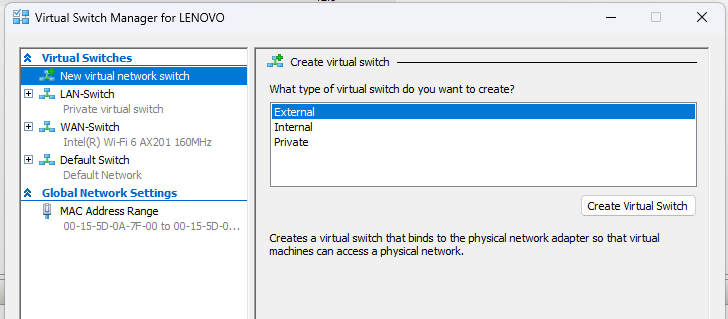

### Virtual Machines (Hyper-V Manager)
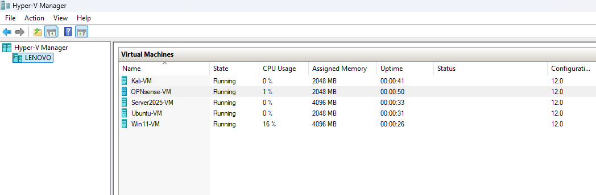

### OPNsense Dashboard


### OPNsense Interfaces


### Network Connectivity Test
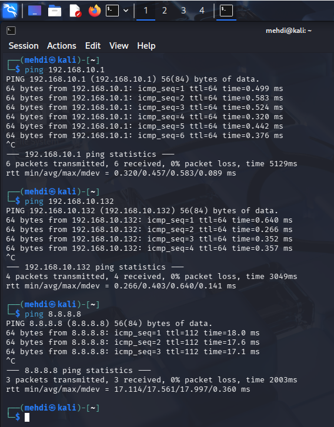

### IP Configuration
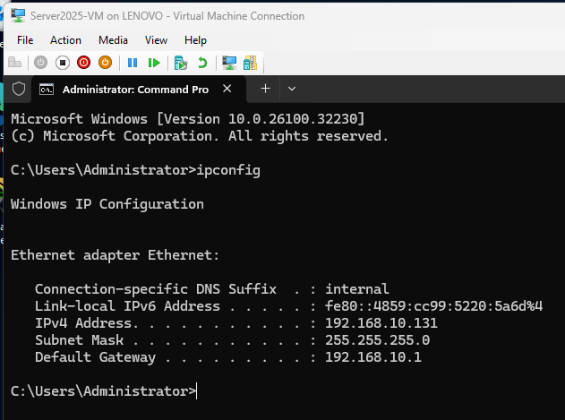

### Problem APIPA
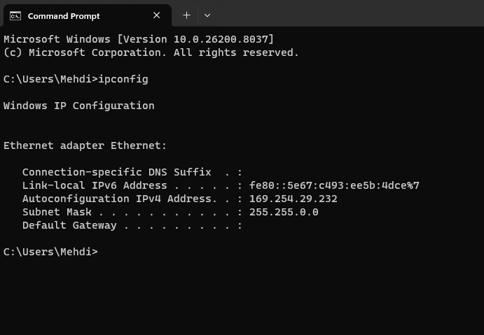

### OPNsense Interface
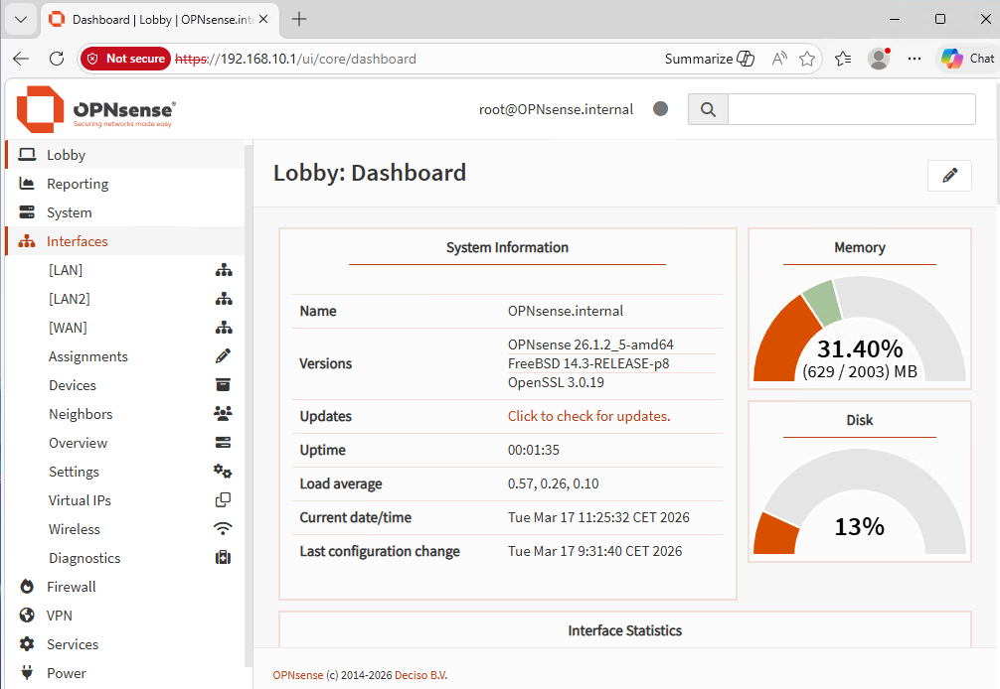

### DHCP
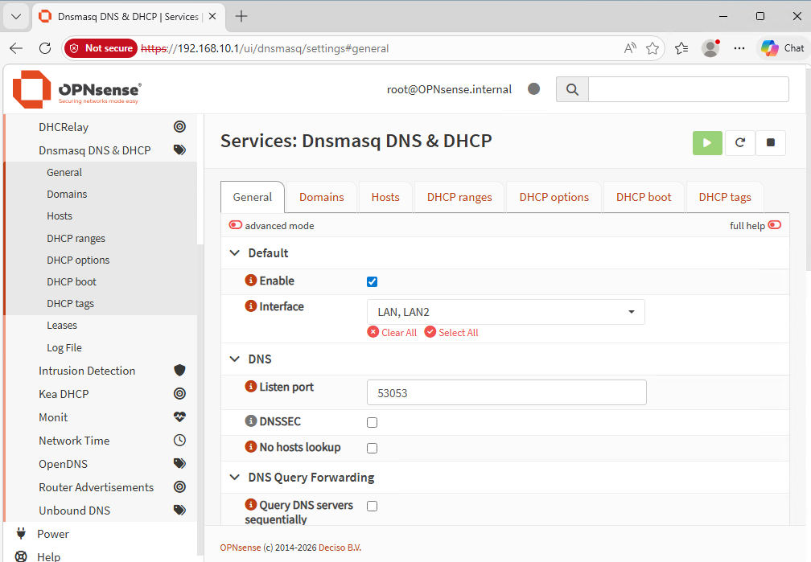

### Result and Ping
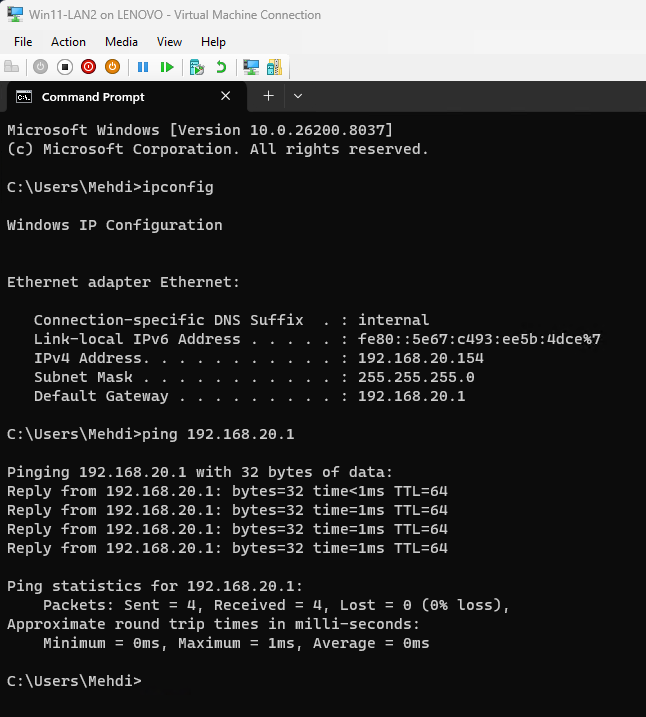

### OPNsense IPv6
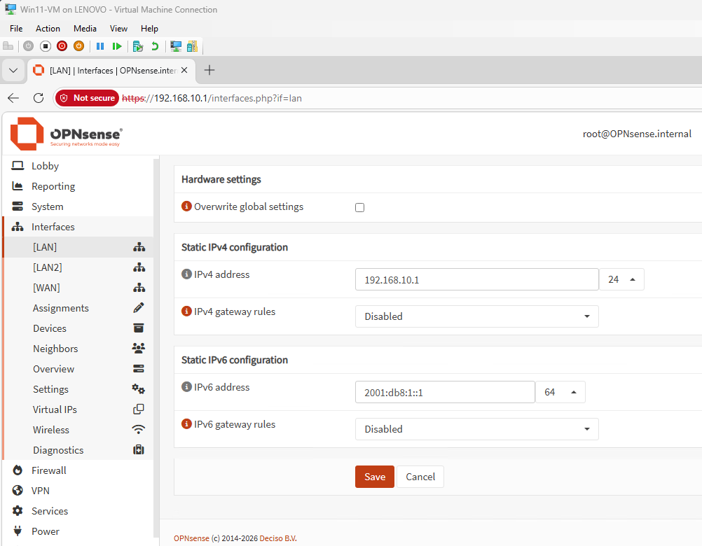

### Windows IPv6
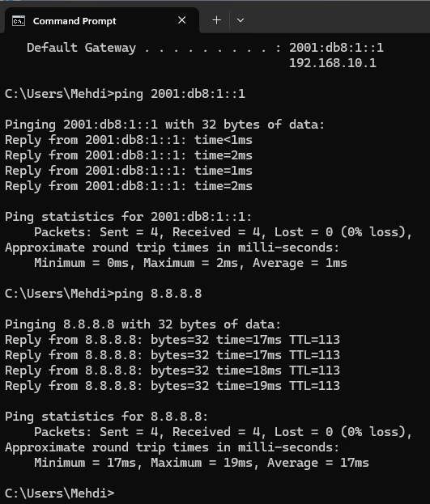

### Ubuntu IPv6
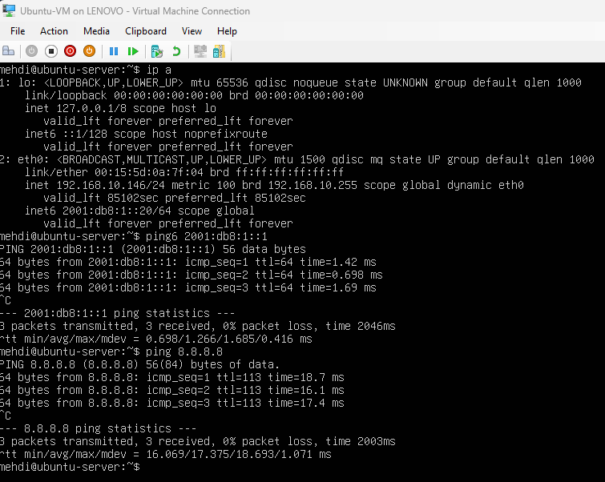

---

## Project Structure

```
hyperv-opnsense-security-lab
│
├── README.md
│
├── docs
│   └── lab-notes.md
│
└── images
    ├── topology.png
    ├── opnsense-dashboard.png
    ├── firewall.png
    ├── hyperv.png
    ├── interfaces.png
    └── ping.png
```

---

## Documentation

Detailed notes and configuration steps are available in the **docs** directory.

Documentation includes:

- installation notes
- configuration steps
- troubleshooting
- lab observations

---

## Results

The lab environment was successfully deployed using Hyper-V with OPNsense acting as the firewall and gateway.

All machines were able to communicate within the LAN and access external networks through the firewall.

Connectivity testing verified that the network configuration works correctly.

---

## Key Skills Demonstrated

| Area | Skills |
|------|--------|
| Virtualization | Hyper-V deployment, VM configuration |
| Networking | LAN/WAN design, IP addressing |
| Security | Firewall configuration using OPNsense |
| Systems | Windows, Linux, Kali Linux |
| Troubleshooting | Connectivity testing, network verification |

---

## Future Lab Extensions

The lab will continue to expand with additional security experiments such as:

- Active Directory deployment
- VLAN segmentation
- IDS/IPS testing
- security monitoring
- attack simulation scenarios

---

## Phase 2 – Network Segmentation (LAN2)

The lab was extended by introducing a second internal network (LAN2) to simulate segmentation.

A new subnet was created:

```
192.168.20.0/24
```

A dedicated Windows 11 client (Win11-LAN2) was connected to this network.

During this phase, a real-world issue occurred where the client received an APIPA address instead of a DHCP lease.

This required troubleshooting of DHCP service behavior across interfaces.

👉 Full technical details are documented in the docs section.

---

## Phase 3 – IPv6 Configuration and NAT Verification

The lab was extended to include **IPv6 configuration** alongside the existing IPv4 network.

This phase demonstrates dual-stack networking, where both IPv4 and IPv6 operate simultaneously without disrupting the existing setup.

---

### IPv6 Implementation

An IPv6 address space was introduced on the LAN interface in OPNsense:

```
2001:db8:1::1/64
```

Client machines were manually configured with IPv6 addresses:

- Windows 11 → `2001:db8:1::10`
- Ubuntu Server → `2001:db8:1::20`

Both clients were assigned the OPNsense LAN IPv6 address as their default gateway.

---

### Connectivity Testing (IPv6)

Connectivity was verified using ICMPv6:

```
ping 2001:db8:1::1
ping6 2001:db8:1::1
```

Successful responses confirmed:

- IPv6 addressing works correctly
- clients can communicate with the firewall
- local IPv6 routing is functional

---

### NAT Configuration (IPv4)

Outbound NAT was configured in OPNsense using **Hybrid mode**.

A rule was added to translate internal IPv4 addresses:

```
192.168.10.0/24 → WAN interface address
```

This ensures that internal clients can access external networks using IPv4.

---

### Internet Connectivity Test

Connectivity to external networks was verified:

```
ping 8.8.8.8
```

Results confirmed:

- NAT is functioning correctly
- outbound traffic is translated properly
- internet access is available from LAN clients

---

### Before vs After

| Stage | IPv4 | IPv6 | NAT | Internet |
|------|------|------|-----|----------|
| Before | ✔ | ❌ | ✔ | ✔ |
| After  | ✔ | ✔ | ✔ | ✔ |

---

### Key Observations

- IPv4 was already fully functional before this phase
- IPv6 was added without affecting existing connectivity
- NAT is required for IPv4 but not typically for IPv6
- Dual-stack networking allows both protocols to coexist

---

### Skills Demonstrated

- IPv6 addressing and configuration
- Dual-stack network implementation
- NAT configuration in OPNsense
- Network testing and verification

---

### Summary

This phase successfully extended the lab environment by introducing IPv6 while maintaining stable IPv4 functionality.

The result is a dual-stack network capable of handling both modern and legacy network traffic.

---

## Conclusion

This project demonstrates how to build a functional cybersecurity lab using virtualization and open-source firewall technology.

The environment provides a safe platform to practice networking, system administration, and security testing.

The lab will continue evolving as new technologies and security scenarios are explored.

---

## Author

**Muhammad Mehdi**

IT Security Developer student
